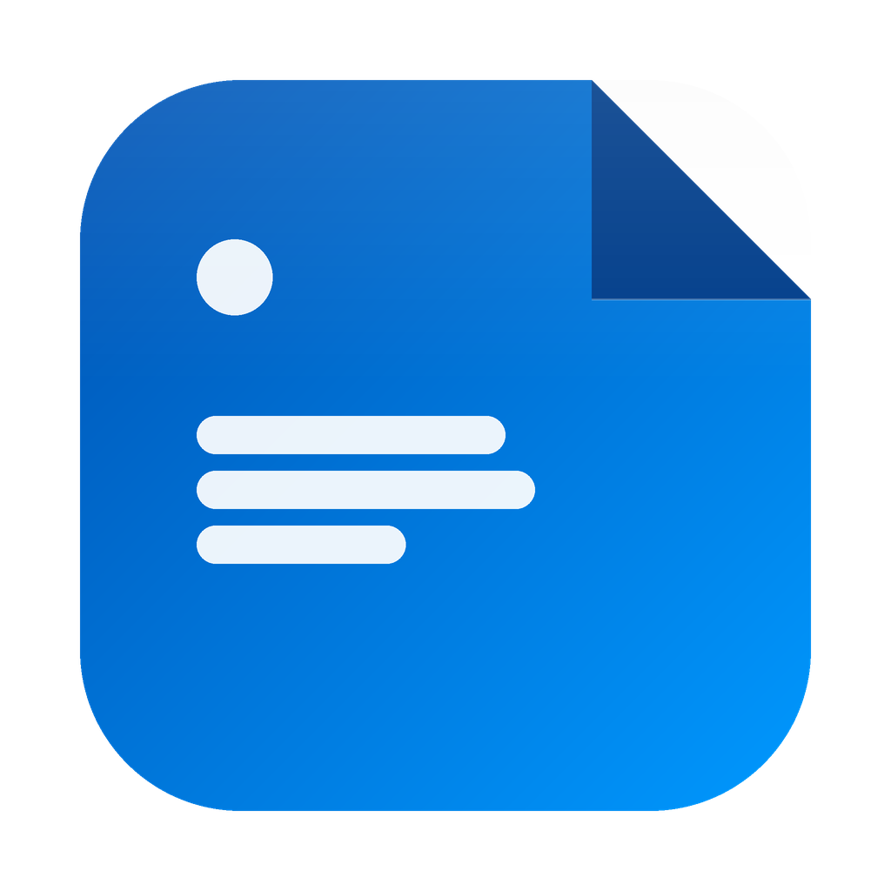

# StickyNotes++

A clean, modern, and professional desktop replacement for Windows Sticky Notes built with **C# .NET WPF**.

<p align="center">
  
</p>

---

## Key Features

- **Fluid Glassmorphism UI**: Uses translucent backgrounds (`AllowsTransparency`) with Windows Fluent design borders, rounded corners, and color tints.
- **My Notes & Clipboard switcher**: A sidebar panel that tracks text and image snippets from your Windows Clipboard history, letting you convert them to notes with a single click.
- **Drag-and-Drop Floating Windows**: Pull note cards straight out of the sidebar list onto your desktop to spawn standalone floating widgets center-anchored to where you drop them.
- **Markdown Preview Mode**: Toggle (`👁`/`✏`) raw editor text into formatted documents featuring titles, headers, bullet points, monospace code blocks, and **interactive checkboxes**.
- **Interactive Checklists**: Checking or unchecking tasks in the Markdown Preview instantly updates the raw note text, database records, and visual representation.
- **Local Ollama AI Integration**: 
  - **Auto Tagging & OCR**: Runs background OCR on screensnips, using local AI to generate contextual hashtags.
  - **Quick AI Formats**: Summarize, grammar-check, bulletize, or rewrite notes professionally in 1 click.
  - **AI Chat Assistant**: Open a collapsible assistant drawer in any note window to ask questions or extract facts from note text/screenshots.
- **Smart Tag Auto-Exporter**: Automatically exports notes to **OneNote** or **Confluence** in the background when tagged with `#onenote` or `#confluence`.
- **System Tray Integration**: Sidebar minimize hides it to the system tray with a double-click restore or context menu action.
- **Desktop reparenting (Pin to Desktop)**: Set notes to reside directly on your desktop wallpaper behind other active windows.

---

## Technology Stack

- **Core Framework**: C# .NET WPF (targeting .NET 10.0 Windows SDK)
- **Database**: SQLite (Microsoft.Data.Sqlite)
- **AI Engine**: Local Ollama Server (`llama3.2:1b` model fallback)
- **OCR Engine**: Windows.Media.Ocr (Native Windows Runtime UWP APIs)
- **API integrations**: Microsoft Graph API (OneNote), Atlassian Confluence REST API

---

## How to Compile and Run

Ensure you have the .NET 10 SDK installed.

1. **Clone/Open the repository**:
   Open terminal inside the directory.

2. **Restore dependencies**:
   ```bash
   dotnet restore
   ```

3. **Build the application**:
   ```bash
   dotnet build
   ```

4. **Run the executable**:
   The output binary will be generated under:
   `bin\Debug\net10.0-windows10.0.19041.0\StickyNotes++.exe`
